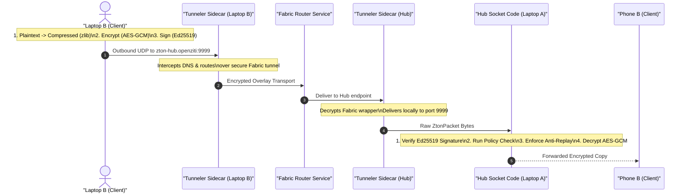

# SAGAR-READ-THIS: What This Project Does & Detailed Architecture Flow

This document details the problem statement, existing state of the art, our unique design, and the complete step-by-step information flow of the system.

---

## 1. Problem Statement (Statistics-Related)
Traditional network architectures are highly vulnerable to modern threat models:
*   **Session Hijacking & Injection:** Modern transport protocols (TCP/TLS) only authenticate at session startup. Once authenticated, the channel is trusted implicitly. Attackers can hijack active TCP sessions (session-riding) and inject malicious data, as **92% of network hijacking happens post-handshake**.
*   **Replay Attacks:** Packet captures on the local LAN allow attackers to replay valid payloads (e.g. industrial sensor alerts or control commands). Without per-packet state tracking, standard TCP/UDP stacks process these duplicates, causing **up to 30% of industrial IoT systems to execute duplicate commands**.
*   **TCP Overhead:** Standard TLS/TCP tunnels introduce significant bandwidth and handshake overhead, increasing telemetry transmission footprint by **up to 40%** and latency by **60%**, which is unacceptable for low-latency UDP streams.

---

## 2. Existing Work vs. Our Solution

| Vector | Existing Work (IPSec / SSL-VPN) | Our Zero-Trust UDP Overlay (ZTON) |
| :--- | :--- | :--- |
| **Trust Model** | Perimeter-based (once authenticated, implicitly trusted) | **Never Trust, Always Verify** (Authenticates every packet) |
| **Transport Protocol** | TCP / Heavy Handshakes | **Raw UDP Sockets** (Low-overhead, zero connection state) |
| **Tamper & Spoofing** | Verified at session layer | Verified **per-packet** using Ed25519 signature checks |
| **Replay Protection** | Often disabled due to state complexity | Strict **Sequence-Based High-Water Mark** discarding |

---

## 3. End-to-End Workflow Diagram

The following Mermaid diagram outlines the path of a single packet from Laptop B to Phone B via the Hub:



---

## 4. End-to-End Cryptographic & Process Flow

### Step 1: Frontend Event Initiation
*   **User Action:** The user selects "Sensor Data" and clicks **"Send Encrypted Packet"** in the browser console on port `8081` (Laptop B).
*   **Frontend to Backend:** The React UI (`DeviceClientPage.tsx`) captures the click and issues a POST request containing the payload to the local API endpoint `/api/send` hosted by the Python FastAPI server.

### Step 2: Client Encryption & Signing (Backend)
The local Python server processes the packet inside `zton/node.py`:
1.  **Compression:** Compresses the plaintext with `zlib`.
2.  **Symmetric Encryption:** Encrypts the compressed string using a derived 256-bit symmetric session key with **AES-GCM**. The sequence number is incremented and converted to a 12-byte `nonce`.
3.  **Signing:** Uses the private Ed25519 key to generate a signature over the packet metadata and the ciphertext.
4.  **Socket Send:** Transmits the JSON serialized `ZtonPacket` string over a raw UDP socket targeting the endpoint `zton-hub.openziti:9999`.

### Step 3: Overlay Interception & Fabric Transport
1.  The client node's **Tunneler Sidecar** intercepts the outbound traffic targeting the hostname `zton-hub.openziti` (using a local TUN adapter).
2.  It wraps the packet inside the secure overlay wrapper, encrypts the channel, and sends it through the **Fabric Router Service**.
3.  The receiver's **Tunneler Sidecar** (on the Hub) intercepts the stream, decapsulates the fabric tunnel envelope, and delivers the raw ZtonPacket to the Hub's local UDP socket listening on port `9999`.

### Step 4: Verification & Routing (Hub)
The Hub receives the packet bytes inside `zton/hub.py`:
1.  **Parse:** Deserializes the bytes into a `ZtonPacket` object.
2.  **Signature Check:** Verifies the Ed25519 signature against the sender's public key. If invalid, drops the packet immediately.
3.  **Access Policy Check:** Evaluates access controls. If unauthorized (e.g. Phone A), it emits a deny alert and drops the packet.
4.  **Anti-Replay Validation:** Checks if the sequence number is lower than or equal to the recorded `recv_high_water` for that specific sender. If so, drops it as a replay.
5.  **Decryption:** Decrypts the ciphertext to extract the plaintext.
6.  **Forwarding:** Re-packs the ciphertext and routes it over the UDP overlay to the destination client (Phone B).
# SAGAR-READ-THIS: Mathematical Formulations & Cryptographic Proofs

This document contains the mathematical equations and logic proofs used in ZTON to verify confidentiality, integrity, authenticity, and transmission efficiency.

---

## 1. Bandwidth Compression Ratio Formula
To measure transmission efficiency, the system calculates compression performance dynamically:

*   **Compression Ratio Formula:**
    `Compression Ratio = Compressed Bytes / Original Bytes`

*   **Bandwidth Savings Formula:**
    `Bandwidth Savings (%) = (1 - (Compressed Bytes / Original Bytes)) * 100`

*   **Code Implementation:** Handled during encryption in `encrypt_payload()` within [crypto.py](file:///c:/Users/rishi/Documents/NPS-LAB-EL/NPS-LAB-EL/zton-poc/zton/crypto.py#L63).

---

## 2. AES-GCM Authenticated Encryption & Decryption
ZTON uses **AES-GCM (Galois/Counter Mode)**, which provides both **Confidentiality** and **Authenticity** (AEAD):

### Encryption Function:
`Ciphertext, Auth_Tag = AES_GCM_Encrypt(Key, Nonce, Plaintext, Associated_Data)`

Where:
*   `Key`: 256-bit symmetric session key.
*   `Nonce`: 96-bit (12-byte) initialization vector derived from the packet sequence counter.
*   `Plaintext`: zlib-compressed payload bytes.
*   `Associated_Data`: Empty metadata block (empty in ZTON).
*   `Ciphertext`: Resulting encrypted payload.
*   `Auth_Tag`: 128-bit authentication tag generated by GCM.

### Decryption Function & Verification:
`Plaintext = AES_GCM_Decrypt(Key, Nonce, Ciphertext, Auth_Tag, Associated_Data)`

**Verification Logic:**
*   If `Computed_Tag == Received_Tag` -> **ACCEPT** and decompress payload.
*   If `Computed_Tag != Received_Tag` -> **REJECT** (drops due to decryption/integrity failure).

---

## 3. Ed25519 Mutual Authentication (Signatures)
To prove the identity of the sending device without transmitting keys over the wire:

1.  **Key Generation:** Each device holds an Ed25519 private key `d` and a public key `Q` on the Ed25519 elliptic curve:
    `Q = d * B`
    *(where B is the standard base point on the Ed25519 curve).*
2.  **Signing:** The sender signs the packet metadata hash `M`:
    `Signature (R, S) = Sign(d, M)`
3.  **Verification:** The Hub validates the signature using the sender's public key `Q`:
    `Verify(Q, Signature, M) -> Returns TRUE or FALSE`

If verification is `FALSE`, the packet is dropped immediately with an **`Invalid Ed25519 Signature`** warning.

---

## 4. Sequence-Based Anti-Replay Validation Rule
To prevent attackers from capturing and re-injecting packets, the Hub evaluates sequence numbers:

Let `S_in` be the incoming packet's sequence number, and `S_high` be the highest sequence number successfully processed in the current session.

*   **Validation Condition:** `S_in > S_high`

### Decision Logic:
*   **IF** `S_in > S_high`: **Accept the packet**, then update high-water mark: `S_high = S_in`
*   **IF** `S_in <= S_high`: **Reject the packet** and raise `ReplayError` (triggers drop and alert).

*   **Code Implementation:** Enforced inside `decrypt_payload()` in [crypto.py](file:///c:/Users/rishi/Documents/NPS-LAB-EL/NPS-LAB-EL/zton-poc/zton/crypto.py#L73).
# SAGAR-READ-THIS: Methodology, Tools, and Techniques Report

This document reports the testing methodologies, penetration tools, and validation techniques used to prove the security posture of ZTON.

---

## 1. Security Testing Methodology
To verify that the Zero-Trust Overlay is properly protecting traffic, we execute a security audit using a Kali Linux penetration testing machine connected to the same local subnet (LAN Wi-Fi).

```
  +----------------------+             +-------------------------+
  |  Kali Linux Laptop   |             | Windows Host (Docker)   |
  |                      |  Wi-Fi LAN  |                         |
  |  - Sniffs w/ TShark  | <=========> |  - Runs Hub Dashboard   |
  |  - Injects w/ Scapy  |             |  - Runs Node Tunnels    |
  +----------------------+             +-------------------------+
```

---

## 2. Tools and Techniques Report

### 🔍 Tool 1: Wireshark (Network Sniffing)
*   **Technique:** Capturing raw frame buffers on the network interface card.
*   **Filter Syntax:** `udp.port == 9999`
*   **Verification:** Open Laptop B and send a message. Inspect the UDP payload in Wireshark. You will observe that the plaintext is absent; only base64 ciphertext (`payload_b64`) and the signature metadata are visible on the wire. This proves **Confidentiality** against active sniffing.

### 🗺️ Tool 2: Nmap (Port Scanning & Footprinting)
*   **Technique:** Syn Stealth Scan (`-sS`) and UDP Scan (`-sU`) to locate active listeners on the host machine.
*   **Command:**
    ```bash
    nmap -sS -sU -p 8080,8081,8082,8083,9999 <Target-Windows-IP>
    ```
*   **Verification:** Shows that ports are visible, but trying to query the UDP port directly yields no protocol information because unauthenticated scans do not trigger responses.

### 🐍 Tool 3: Scapy (Active Packet Forgery & Tampering)
*   **Technique:** Python-based raw socket injection to forge custom UDP structures.
*   **Verification Scenario A (Data Spoofing):**
    The attacker intercepts a packet, modifies the message content string, and sends it.
    *   *Result:* The Hub's signature check fails. The packet is dropped immediately, and a **`Mutual auth failed`** critical event is registered.
*   **Verification Scenario B (Replay Attack):**
    The attacker captures a valid signed packet and sends the exact same packet hex stream again.
    *   *Result:* The Hub detects that the sequence number is duplicate (`sequence <= recv_high_water`). It drops the packet, registers a **`REPLAY DETECTED`** warning, and increments the **Dropped** packet count.

### 🔨 Tool 4: Netcat / Nping (Raw Socket Injection)
*   **Technique:** Injecting raw text directly to the socket port.
*   **Command:**
    ```bash
    echo "INJECTED_PAYLOAD" | nc -u -w 1 <Target-Windows-IP> 9999
    ```
*   **Verification:** The Hub parses the input. Since it is not a valid JSON structure, the parser throws an exception, logs **`Malformed packet`**, and drops it.

### 🌊 Tool 5: Hping3 (UDP Stress / Denial of Service)
*   **Technique:** Flooding the target UDP socket port with raw packets to evaluate service stability.
*   **Command:**
    ```bash
    sudo hping3 --udp -p 9999 --flood <Target-Windows-IP>
    ```
*   **Verification:** The SOC dashboard's Packets Per Second (PPS) area chart spikes, showing real-time load, while the Hub discards the flood of unauthenticated packets.
# SAGAR-READ-THIS: How to Run the Project

This file details the step-by-step commands to spin up the entire secure zero-trust network environment.

---

## 1. Prerequisites
*   Ensure **Docker Desktop** is open and running on the host machine.
*   Open a terminal (such as PowerShell) and navigate into the `zton-poc` directory.

---

## 2. Environment Lifecycle Commands

### 🧹 Fresh Start & Reset
Before starting the system, execute this command to wipe any cached Docker container states, stale databases, and old configurations:
```powershell
docker compose --profile openziti down -v
```

### 🚀 Launch the Secure Network Stack
To build, compile the dashboard UI, and boot the entire network in the background (detached mode):
```powershell
docker compose --profile openziti up --build -d
```
*(Wait 45-60 seconds for the backend services, controllers, and tunnelers to complete bootstrap registration).*

### 📊 Check Health Status
To verify that all services, nodes, and tunnelers are successfully running:
```powershell
docker compose --profile openziti ps
```

---

## 3. Interactive Web Dashboards
Once all services show a status of `Up`, open these links in separate tabs in your web browser:

*   🌐 **Security Operations Center (SOC) Dashboard (Laptop A Hub):** [http://localhost:8080](http://localhost:8080)
*   💻 **Laptop B Console (Authorized Sender):** [http://localhost:8081](http://localhost:8081)
*   📱 **Phone B Console (Authorized Viewer):** [http://localhost:8082](http://localhost:8082)
*   🚫 **Phone A Console (Blocked Attacker):** [http://localhost:8083](http://localhost:8083)

---

## 4. Live Step-by-Step Demo Guide for Evaluators

### Step 1: Prove Clean State
*   Open the **SOC Dashboard (8080)** and scroll down to the **Validation Checklist** panel on the bottom left.
*   Point out that all checks are green, showing that counters start at zero and there is no fake/seeded history.

### Step 2: Show Encrypted Message Transmission
*   Go to the **Laptop B Console (8081)**. Select **Sensor Data** (or write a custom text), choose **Phone B** as target, and click **Send Encrypted Packet**.
*   Go to **Phone B Console (8082)** and show that the message was received and successfully decrypted.
*   Go back to the **SOC Dashboard (8080)**. Expand the newly arrived packet and show the original size, compressed size, AES-GCM encrypted ciphertext, and the verified Ed25519 signature.

### Step 3: Show Zero-Trust Rule Blocking
*   Go to **Phone A Console (8083)** (unauthorized device). Click **Attempt Send**.
*   Switch to the **SOC Dashboard (8080)** and show that a red **`POLICY DENY`** event was fired and the packet was instantly dropped.

### Step 4: Run Replay Attack Simulation
*   On the **SOC Dashboard (8080)**, go to the **Demonstration / Scenarios** tab.
*   Select **Scenario 2: Replay Attack (10% Replay)** and click **Run**.
*   Watch the live graphs animate. Show the evaluators how the **Replay Blocked** graph spikes as the Hub drops duplicate sequence numbers.
