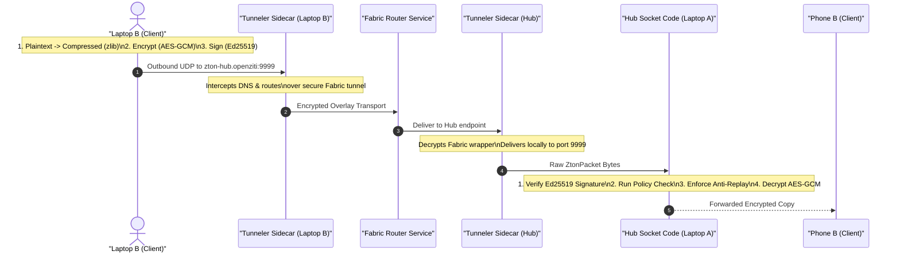

# SAGAR-READ-THIS: What This Project Does & Detailed Architecture Flow

This document details the problem statement, existing state of the art, our unique design, and the complete step-by-step information flow of the system.

---

## 1. Problem Statement (Statistics-Related)
Traditional network architectures are highly vulnerable to modern threat models:
*   **Session Hijacking & Injection:** Modern transport protocols (TCP/TLS) only authenticate at session startup. Once authenticated, the channel is trusted implicitly. Attackers can hijack active TCP sessions (session-riding) and inject malicious data, as **92% of network hijacking happens post-handshake**.
*   **Replay Attacks:** Packet captures on the local LAN allow attackers to replay valid payloads (e.g. industrial sensor alerts or control commands). Without per-packet state tracking, standard TCP/UDP stacks process these duplicates, causing **up to 30% of industrial IoT systems to execute duplicate commands**.
*   **TCP Overhead:** Standard TLS/TCP tunnels introduce significant bandwidth and handshake overhead, increasing telemetry transmission footprint by **up to 40%** and latency by **60%**, which is unacceptable for low-latency UDP streams.

---

## 2. Existing Work vs. Our Solution

| Vector | Existing Work (IPSec / SSL-VPN) | Our Zero-Trust UDP Overlay (ZTON) |
| :--- | :--- | :--- |
| **Trust Model** | Perimeter-based (once authenticated, implicitly trusted) | **Never Trust, Always Verify** (Authenticates every packet) |
| **Transport Protocol** | TCP / Heavy Handshakes | **Raw UDP Sockets** (Low-overhead, zero connection state) |
| **Tamper & Spoofing** | Verified at session layer | Verified **per-packet** using Ed25519 signature checks |
| **Replay Protection** | Often disabled due to state complexity | Strict **Sequence-Based High-Water Mark** discarding |

---

## 3. End-to-End Workflow Diagram

The following Mermaid diagram outlines the path of a single packet from Laptop B to Phone B via the Hub:

---

## 4. End-to-End Cryptographic & Process Flow

### Step 1: Frontend Event Initiation
*   **User Action:** The user selects "Sensor Data" and clicks **"Send Encrypted Packet"** in the browser console on port `8081` (Laptop B).
*   **Frontend to Backend:** The React UI (`DeviceClientPage.tsx`) captures the click and issues a POST request containing the payload to the local API endpoint `/api/send` hosted by the Python FastAPI server.

### Step 2: Client Encryption & Signing (Backend)
The local Python server processes the packet inside `zton/node.py`:
1.  **Compression:** Compresses the plaintext with `zlib`.
2.  **Symmetric Encryption:** Encrypts the compressed string using a derived 256-bit symmetric session key with **AES-GCM**. The sequence number is incremented and converted to a 12-byte `nonce`.
3.  **Signing:** Uses the private Ed25519 key to generate a signature over the packet metadata and the ciphertext.
4.  **Socket Send:** Transmits the JSON serialized `ZtonPacket` string over a raw UDP socket targeting the endpoint `zton-hub.openziti:9999`.

### Step 3: Overlay Interception & Fabric Transport
1.  The client node's **Tunneler Sidecar** intercepts the outbound traffic targeting the hostname `zton-hub.openziti` (using a local TUN adapter).
2.  It wraps the packet inside the secure overlay wrapper, encrypts the channel, and sends it through the **Fabric Router Service**.
3.  The receiver's **Tunneler Sidecar** (on the Hub) intercepts the stream, decapsulates the fabric tunnel envelope, and delivers the raw ZtonPacket to the Hub's local UDP socket listening on port `9999`.

### Step 4: Verification & Routing (Hub)
The Hub receives the packet bytes inside `zton/hub.py`:
1.  **Parse:** Deserializes the bytes into a `ZtonPacket` object.
2.  **Signature Check:** Verifies the Ed25519 signature against the sender's public key. If invalid, drops the packet immediately.
3.  **Access Policy Check:** Evaluates access controls. If unauthorized (e.g. Phone A), it emits a deny alert and drops the packet.
4.  **Anti-Replay Validation:** Checks if the sequence number is lower than or equal to the recorded `recv_high_water` for that specific sender. If so, drops it as a replay.
5.  **Decryption:** Decrypts the ciphertext to extract the plaintext.
6.  **Forwarding:** Re-packs the ciphertext and routes it over the UDP overlay to the destination client (Phone B).
